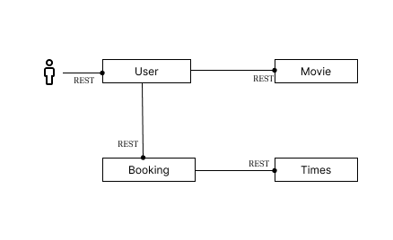

## Overview

As part of our Distributed System course at IMT Atlantique, this project is about the implementation of REST APIs in the context of a movie booking system with 4 microservices.

The four services are: `movie`, `booking`, `showtime` and `user`, where a user can book a movie, which should be in a showtime:



The endpoints of each service are specified in an OpenAPI Specification based YAML file in the corresponding folder.

We used `Python`, `Flask`, `Docker` and `Docker Compose`

## Running it locally

You should have Docker and Docker Compose installed. After that, it's as simple as cloning this repository, opening a terminal window in the project root folder, and running:

```sh
docker-compose up
```

The user service can be accesd on `http://localhost:3203`, the showtime on `http://localhost:3202`, the booking on `http://localhost:3201`, and the movie on `http://localhost:3200`.
